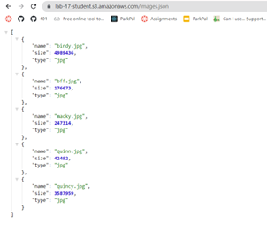

# AWS: S3 and Lambda -- Lab 17

## Author: Alan Chelko

    * Collaboration: in-class demos, Robert Ball, Felix Yu (online)

## Problem Domain

    * AWS Lambda allows writing code that is triggered in the cloud, without thinking about maintaining servers. We’ll use it today to automatically run some processing on image files after they’re uploaded to an S3 Bucket.

## Feature Tasks & Requirements

    * Create an S3 Bucket with “open” read permissions, so that anyone can see the images/files in their browser.
    * A user should be able to upload an image at any size, and update a dictionary of all images that have been uploaded so far
    * When an image is uploaded to your S3 bucket, it should trigger a Lambda function which must:
        * Download a file called “images.json” from the S3 Bucket if it exists
        * The images.json should be an array of objects, each representing an image. Create an empty array if this file is not present
        * Create a metadata object describing the image
            * Name, Size, Type, etc.
        * Append the data for this image to the array
            * Note: If the image is a duplicate name, update the object in the array, don’t just add it
        * Upload the images.json file back to the S3 bucket

## Documentation

### Link to images.json file

[images.json file](https://lab-17-student.s3.amazonaws.com/images.json)

### How to use the lamba

* Lamba connected with a PUT trigger  to the S3 bucket that is activated whenever a .jpg file is uploaded to the S3 bucket.
* The array of objects in the images.json file is automatically updated whenever a .jpg file is uploaded.

